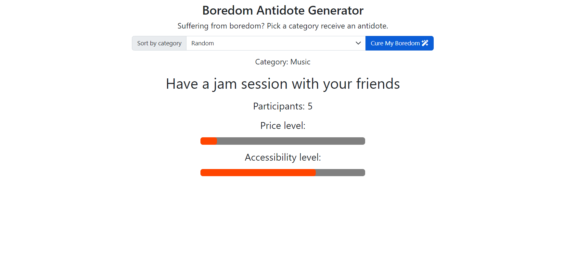

# Boredom Antidote Generator

Boredom Antidote Generator is an application that allows users to generated a random or category-specific suggestion to cure their boredom, and provides pertinent info about the suggestion. The app is built with Bootstrap HTML, CSS, and JavaScript and uses the boredAPI API to retrieve suggestions and details.

## Technologies Used
The following technologies were used to build this application:
- Bootstrap HTML
- CSS
- JavaScript
- [BoredApi](https://www.boredapi.com/)
## Features
- Generate a random suggestion for something to do, or filter by category
  - Results include the suggested task, the number of participants needed to perform it, and the price and accessibility levels.

### Usage
[Click here to open live demo](https://wraytheon.github.io/boredom-Solver-API/)

Pick a category from the dropdown and click the "Cure My Boredom" button to generate a specific or random idea to cure your boredom.

### Contributing
Contributions to the project are welcome. To contribute, follow these steps:

1. Fork the repository.
2. Create a new branch with a descriptive name for your feature or bug fix.
3. Make changes to the code.
4. Test your changes to make sure they work as expected.
5. Commit your changes.
6. Push your changes to your fork.
7. Submit a pull request.

#### Credits
This application was built using the following resources:
- [BoredApi](https://www.boredapi.com/)
- [Bootstrap](https://getbootstrap.com/)

#### License
This application is licensed under the MIT license. See LICENSE for more information.